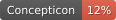

# kinbank/varikin

## How to cite

If you use these data please cite
this dataset using the DOI of the [particular released version](../../releases/) you were using

## Description

## Statistics

- **Varieties:** 1,287 (linked to 1,183 different Glottocodes)
- **Concepts:** 1,332 (linked to 19 different Concepticon concept sets)
- **Lexemes:** 218,412
- **Sources:** 1,062
- **Synonymy:** 1.34

## Possible Improvements:

- Entries missing sources: 1634/218412 (0.75%%)

## CLDF Datasets

The following CLDF datasets are available in [cldf](cldf):

- CLDF [Wordlist](https://github.com/cldf/cldf/tree/master/modules/Wordlist) at [cldf/cldf-metadata.json](cldf/cldf-metadata.json)